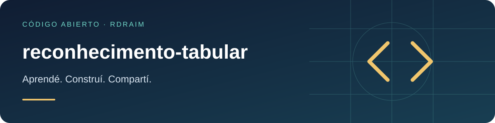

<p align="right">
  <a href="README.md"></a>
  <a href="README.en-US.md"></a>
  <a href="README.es-AR.md"></a>
</p>

# reconhecimento-tabular



[](LICENSE) [](https://github.com/Rdraim/reconhecimento-tabular/actions) [](https://github.com/Rdraim/reconhecimento-tabular/releases) [](https://github.com/Rdraim/reconhecimento-tabular/commits/main) [](https://github.com/Rdraim/reconhecimento-tabular/stargazers) [](https://github.com/Rdraim/reconhecimento-tabular/forks)

<p>
  <a href="https://github.com/Rdraim/reconhecimento-tabular/tree/main/examples"></a>
  <a href="https://github.dev/Rdraim/reconhecimento-tabular"></a>
  <a href="https://github.com/Rdraim/reconhecimento-tabular/archive/refs/heads/main.zip"></a>
</p>


Convertí la salida de extractores en celdas trazables con confianza y revisión humana.

## Instalación

```bash
git clone https://github.com/Rdraim/reconhecimento-tabular.git
cd reconhecimento-tabular
npm test
node examples/basic.mjs
```

## Ejemplo ejecutable

```js
import {reconhecer} from './src/index.js';
console.log(await reconhecer('exemplo',{tipo:'imagem',adaptadores:{imagem:async()=>[[{texto:'Total',confianca:0.98},{texto:'100',confianca:0.65}]]}}));
```

## API

`reconhecer(entrada, {tipo, adaptadores, limiar:0.9, maxCelulas:100000})` exige adaptador explícito csv, xlsx, pdf-texto o imagem. Celdas: texto o `{texto, confianca}`. Devuelve filas, motivos por posición y prontoParaImportar. La confianza desconocida requiere revisión.

## Límites

Sin motor OCR, lector XLSX o parser PDF incorporado. Los adaptadores deben limitar bytes, tiempo y memoria antes de extraer; maxCelulas limita sólo la salida. Confianza alta no certifica exactitud. Importaciones críticas requieren revisión y autorización.

## Compatibilidad

Núcleo sin dependencias de ejecución. CI con Node.js 22 y 24. Instalación desde Git; este proyecto no está publicado en npm. Revisá Releases y fijá una tag/commit al integrar. Actualizaciones requieren revisar licencia, engines y pruebas del consumidor. Un badge de CI no certifica seguridad.

[Compatibilidad](COMPATIBILITY.es-AR.md) · [Contribuciones](CONTRIBUTING.es-AR.md) · [Seguridad](SECURITY.es-AR.md)

MIT © Rodrigo Rodrigues

## ☕ Invitame un café

¿Este proyecto te ayudó a resolver un problema, aprender algo nuevo o dar tus primeros pasos en desarrollo? Si querés apoyar mi trabajo, un café es una linda forma de agradecer.

Soy **Rodrigo Rodrigues**, creador de **Nexus** y de estos proyectos de código abierto. Tu aporte me ayuda a dedicar tiempo a mejorar el código, escribir ejemplos más claros y seguir compartiendo lo que aprendo.

**Aportá el monto que tenga sentido para vos. El apoyo es totalmente voluntario; el proyecto sigue siendo gratuito bajo la licencia MIT.**

[Apoyá con Pix](#apoyá-con-pix) · [Dejá un comentario](https://github.com/techrodrigo21-ux/reconhecimento-tabular/issues/new?title=Comentario%3A%20este%20proyecto%20me%20ayud%C3%B3)

### Apoyá con Pix

En la app de tu banco, escaneá el QR o copiá la clave Pix de abajo. Elegí el monto y revisá los datos del destinatario antes de confirmar.

<p align="center">
  
</p>

**Clave Pix**

```text
8875a24e-44d1-4c91-b6bb-62c9f0070955
```

Pix es el sistema de pagos de Brasil. Si tu banco no lo admite, también podés ayudar compartiendo el proyecto, reportando un problema, mejorando la documentación o dejando un comentario.

### Tu comentario también suma

[Contame cómo te ayudó el proyecto](https://github.com/techrodrigo21-ux/reconhecimento-tabular/issues/new?title=Comentario%3A%20este%20proyecto%20me%20ayud%C3%B3). Me gustaría saber qué creaste, qué aprendiste y qué podría ser más claro para quienes recién empiezan.

Los comentarios son bienvenidos con o sin donación. Cuidá tu privacidad: no publiques comprobantes de pago, datos personales, credenciales ni información privada de usuarios en las Issues.

**Gracias por apoyar mi trabajo y ayudarme a seguir creando y compartiendo. ❤️**
